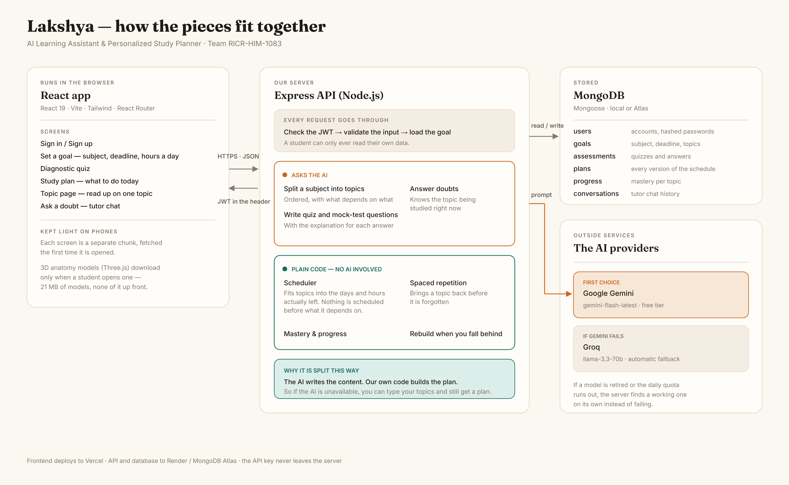

# Lakshya — AI Learning Assistant & Personalized Study Planner

> Because no two students learn the same way — so why should they all get the same study plan?

**Lakshya** (लक्ष्य — *the target*) turns a vague intention like *"I need to clear my DBMS paper in 12 days"*
into an honest, day-by-day plan built around what the student actually knows, how much time they
really have, and which topics are quietly going to cost them marks.

---

## Team

| | |
|---|---|
| **Team Name** | RICR-HIM-1083 |
| **Team Code** | RICR-HIM-1083 |
| **Selected Theme** | Education & EdTech |
| **Event** | HackInMotion 2026 · 12–15 August 2026 |

### Team Members

| Name | GitHub | Role |
|---|---|---|
| Ankit Kumar | [@iamankit07](https://github.com/iamankit07) | Team Lead · Backend & AI integration |
| Kamalneet Kaur | [@kamalneetkaur666](https://github.com/kamalneetkaur666) | Frontend & UI/UX |

---

## Problem Statement

Build an AI Learning Assistant & Personalized Study Planner — a web application where a student can
state what they need to learn or prepare for, receive a personalized study plan based on their
current knowledge level and available time, and get instant AI-powered help while studying.

Most study tools hand every student the same syllabus at the same pace. The result is familiar:
hours burnt revising what you already know, weak topics left untouched until the night before, and
no one to ask when you get stuck at 2 AM. Personal tutoring solves this, but it is expensive and
unevenly available.

The full problem statement is in [`docs/problem-statement.md`](docs/problem-statement.md).

---

## Solution Overview

Lakshya splits the job between two systems that are good at different things.

**The language model understands the subject.** Given a goal like *"Operating Systems — university
end-sem, 12 days"*, it decomposes the subject into a topic graph: individual topics, what each one
depends on, how hard it is, and roughly how long it takes to learn. It also writes the diagnostic
questions, the explanations, and the mock tests.

**Our scheduler understands the student.** The topic graph, the student's measured mastery per
topic, their real daily availability, and the deadline all go into a deterministic planning
algorithm we wrote ourselves. It orders topics so prerequisites come first, weights study time
toward weak areas, packs sessions into the hours the student actually has, and schedules spaced
revision so earlier topics don't decay.

Keeping the schedule out of the language model is a deliberate engineering decision:

- **It adapts instantly.** Falling behind or failing a re-test triggers a re-plan in milliseconds,
  with no API call and no cost.
- **It stays reliable.** The plan is reproducible and testable. The same inputs always give the
  same schedule, which is not true of a model asked to output a calendar.
- **It survives outages.** If the AI provider is down or rate-limited, an existing plan still
  re-plans, and the app degrades feature-by-feature instead of collapsing.

### What a student can do

1. Create an account and sign in — every goal, plan, result and conversation is private to them.
2. Set a learning goal: subject, deadline, hours available per day, self-rated confidence.
3. Take a short diagnostic quiz that measures actual understanding per topic.
4. Get a day-by-day plan that front-loads weak areas and fits the time available.
5. Ask the built-in tutor questions about whatever they're studying right now.
6. Mark sessions complete and watch progress against the plan.
7. Generate mock tests from their own plan's topics to validate what stuck.
8. Fall behind, and have the plan quietly rebuild itself around the time that's left.

---

## Technology Stack

| Layer | Choice | Why |
|---|---|---|
| Frontend | React 19 + Vite + Tailwind CSS | Fast dev loop, small production bundle, good mobile performance |
| Backend | Node.js + Express | Same language across the stack, quick to build REST APIs |
| Database | MongoDB Atlas (Mongoose) | Study plans are nested, irregular documents — a document store fits better than rigid tables |
| Authentication | JWT with bcrypt password hashing | Stateless, no session store needed, simple to deploy |
| AI / LLM | Google Gemini (primary), Groq (fallback) | See below |
| Deployment | Vercel (frontend) · Render (backend) · MongoDB Atlas (database) | Free tiers sufficient for the demo |

### AI Provider: which, why, and how

**Chosen: Google Gemini API (`gemini-2.5-flash`), with Groq as an automatic fallback.**

We compared the options available to a student team with no budget:

| Option | Free tier | Structured output | Verdict |
|---|---|---|---|
| **Google Gemini** | Generous daily free quota, no card required | Native JSON schema enforcement | **Chosen as primary** |
| **Groq** | Free tier, extremely low latency on open models | JSON mode | **Chosen as fallback** |
| OpenAI | Paid from the start | Excellent | Ruled out — no budget |
| Anthropic Claude | Paid from the start | Excellent | Ruled out — no budget |
| Self-hosted open model | Free | Varies | Ruled out — no GPU, and cold starts would wreck the demo |

Gemini won on two things that mattered more than raw quality. First, it enforces a **response
schema server-side**, so topic graphs and quiz questions come back as valid, correctly-shaped JSON
instead of prose we'd have to parse defensively. Second, its free tier is workable for a live demo
without a credit card.

Groq exists in the stack because a hackathon demo cannot afford a single point of failure. Every AI
call goes through one provider-agnostic module; if Gemini errors or rate-limits, the same request is
retried against Groq automatically, and only if both fail does the app fall back to a cached or
degraded response.

Full integration details, prompt design and failure handling: [`docs/ai-integration.md`](docs/ai-integration.md).

---

## Repository Structure

```
HackInMotion-RICR-HIM-1083/
├── frontend/                 React + Vite client
├── backend/                  Express API server
├── docs/                     Design notes, AI integration, problem statement
├── assets/                   Screenshots and diagram sources
├── architecture-diagram.png
├── api-documentation.md
├── presentation.pptx
└── README.md
```

---

## Installation Guide

Requires Node.js 20+ and a MongoDB connection string (local or Atlas).

```bash
git clone https://github.com/iamankit07/HackInMotion-RICR-HIM-1083.git
cd HackInMotion-RICR-HIM-1083
```

**Backend**

```bash
cd backend
npm install
cp .env.example .env      # then fill in the values below
npm run dev               # starts on http://localhost:5000
```

**Frontend** (in a second terminal)

```bash
cd frontend
npm install
cp .env.example .env
npm run dev               # starts on http://localhost:5173
```

---

## Environment Variables

**`backend/.env`**

| Variable | Required | Description |
|---|---|---|
| `PORT` | no | API port. Defaults to `5000`. |
| `MONGODB_URI` | yes | MongoDB connection string. |
| `JWT_SECRET` | yes | Secret used to sign access tokens. Use a long random string. |
| `JWT_EXPIRES_IN` | no | Token lifetime. Defaults to `7d`. |
| `GEMINI_API_KEY` | yes | Google AI Studio key — the primary AI provider. |
| `GROQ_API_KEY` | no | Groq key. Without it the fallback provider is simply skipped. |
| `CLIENT_ORIGIN` | no | Allowed CORS origin. Defaults to `http://localhost:5173`. |

**`frontend/.env`**

| Variable | Required | Description |
|---|---|---|
| `VITE_API_URL` | yes | Base URL of the backend API. |

Neither `.env` file is committed. Both directories ship a `.env.example` listing every key.

---

## API Documentation

Every endpoint, request body, and error response is documented in
[`api-documentation.md`](api-documentation.md).

---

## Database Details

MongoDB, accessed through Mongoose. Six collections:

| Collection | Holds |
|---|---|
| `users` | Account credentials and profile |
| `goals` | Learning goals plus the AI-generated topic graph for each |
| `assessments` | Diagnostic and mock test attempts, with per-question results |
| `plans` | Generated study plans and their sessions |
| `progress` | Per-topic mastery scores and spaced-repetition state |
| `conversations` | Tutor chat history, scoped to a user and goal |

Schema definitions and the reasoning behind them: [`docs/database-design.md`](docs/database-design.md).

---

## Architecture Diagram



---

## Screenshots

*Added as the interface is built.*

---

## Deployment Link

*Deployed once the core flow is complete — link will appear here.*

---

## Future Scope

- **Group study mode** — students preparing for the same exam compare progress and share plans.
- **Voice doubt-solving** — ask a question out loud, hear the explanation back, for revision on the move.
- **Institution dashboard** — teachers see aggregate weak topics across a class and adjust teaching.
- **Offline-first plans** — service worker caching so the day's plan opens without a connection.
- **Regional language support** — explanations in Hindi and other Indian languages, which is where
  the accessibility gap is widest.
